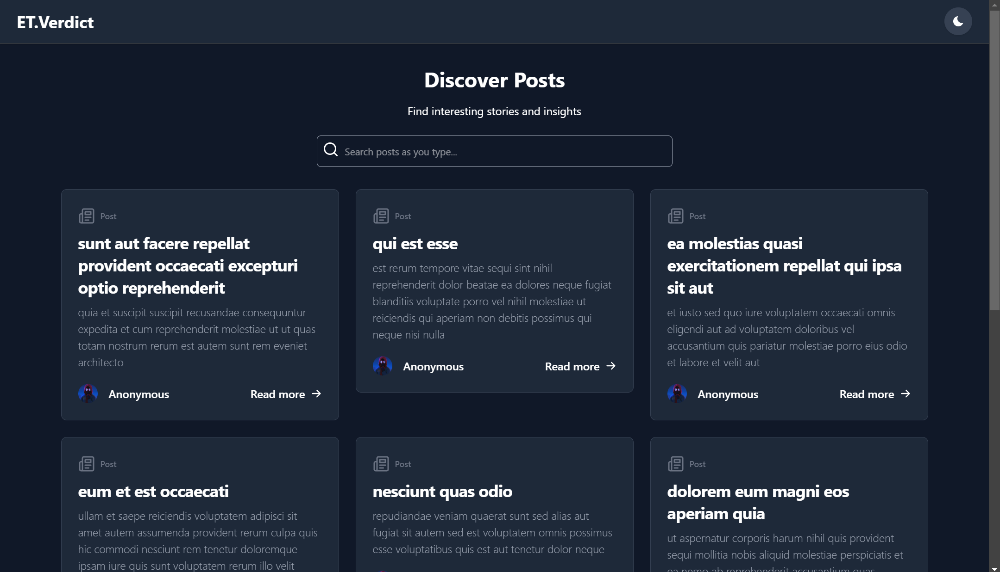

# ET.Verdict Blog

This project fetches posts from JSONPlaceholder and displays them with an auto-scroll feature. It also includes a search functionality to filter posts based on user input. The tech stack includes **Tailwind CSS**, **React JS**, and **TanStack Query**.



## Table of Contents

- [Installation](#installation)
- [Usage](#usage)
- [Feature Explanation](#Feature-Explanation)
- [Contact](#Contact)


## Installation

1. Clone the repository:
    ```sh
    git clone https://github.com/sayrgyiwoody/et-verdict.git
    ```
2. Navigate to the project directory:
    ```sh
    cd et-verdict
    ```
3. Install dependencies:
    ```sh
    npm install --legacy-peer-deps
    ```
    > **Note:** Please install with`--legacy-peer-deps`to encounter dependency conflicts during installation.

## Usage
1. Run Development Server
    ```sh
    npm run dev
    ```
2. Open your browser and navigate to `http://localhost:5173` to view the application.
3. Use the search bar to filter posts by keywords.
4. Scroll through the posts to see the auto-scroll feature in action.

## Feature Explanation

- This project fetches an initial set of 10 posts from the JSONPlaceholder API and displays them in a list. As the user scrolls, additional posts are fetched and appended to the list. The application utilizes **TanStack Query** to cache the fetched data, enhancing the user experience. The `useInfiniteQuery` hook is employed to manage the **infinite scrolling** functionality.

- For the search functionality, since JSONPlaceholder does not provide a search endpoint, the application performs the search on the client side. As the user types in the search bar, the posts are filtered in real-time from the fetched data.

- The application includes a **Dark Mode Toggle**  button that allows users to switch between light and dark themes. The current theme preference is saved in the local storage.

> The project has been deployed for demonstration purposes and can be viewed at the following link: [https://et-verdict.vercel.app](https://et-verdict.vercel.app)

## Contact

Wai Yan Tun - [https://waiyantun.tech](https://waiyantun.vercel.app/) 
>contact me via my portfolio

Project Demo: [https://et-verdict.vercel.app](https://et-verdict.vercel.app/) 
> Click the URL to view the project demo.
